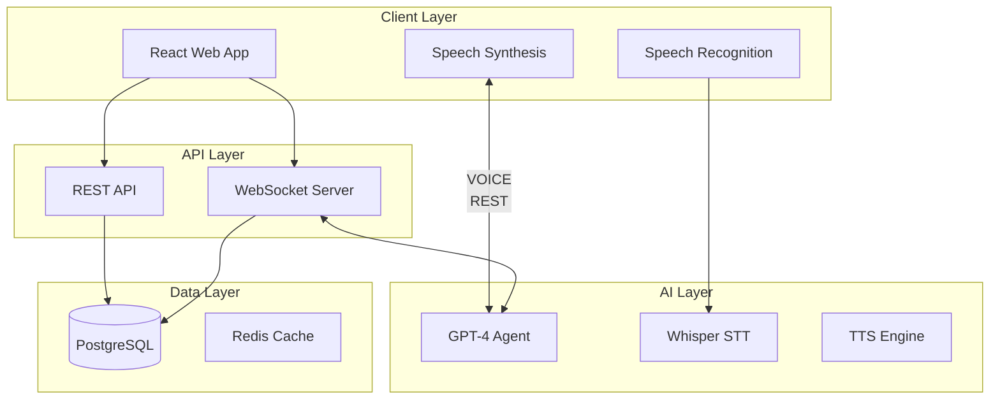

# Học Tiếng Anh với AI - Technical Specification

## 1. Project Overview

**Project Name:** hoctienganh - AI English Learning Platform  
**Type:** Web Application (React + Node.js)  
**Core Functionality:** An interactive English learning platform featuring AI-powered live conversation practice with speech recognition and synthesis  
**Target Users:** Vietnamese learners of English (beginner to advanced levels)

---

## 2. Technology Stack

### Frontend
- **Framework:** React 18 with TypeScript
- **State Management:** Zustand
- **Styling:** Tailwind CSS
- **Speech Recognition:** Web Speech API / Whisper.cpp
- **Speech Synthesis:** Web Speech API
- **Real-time Communication:** WebSocket (Socket.io)
- **HTTP Client:** Axios

### Backend
- **Runtime:** Node.js 18+
- **Framework:** Express.js
- **Database:** PostgreSQL with Prisma ORM
- **AI Integration:** OpenAI API (GPT-4) + Whisper API
- **Real-time:** Socket.io
- **Authentication:** JWT + bcrypt
- **File Storage:** Local/Cloud (AWS S3)

### AI Services
- **Conversation Agent:** OpenAI GPT-4 API
- **Speech-to-Text:** OpenAI Whisper API / Web Speech API
- **Text-to-Speech:** Web Speech API / Eleven Labs API

---

## 3. System Architecture



---

## 4. Core Features

### 4.1 AI Conversation Partner
- Real-time voice chat with AI agent
- Context-aware conversation based on user's English level
- Topic selection (daily life, business, travel, etc.)
- Grammar correction and suggestions
- Vocabulary explanations during conversation

### 4.2 Lesson System
- Structured lessons by level (A1-C2)
- Grammar tutorials with examples
- Vocabulary flashcards with pronunciation
- Reading and writing exercises
- Progress tracking

### 4.3 Speech Features
- Voice input for speaking practice
- Pronunciation scoring
- Real-time speech-to-text
- Text-to-speech for AI responses
- Voice speed adjustment

### 4.4 User Management
- User registration/login
- Progress tracking
- Learning history
- Favorites/bookmarks
- Settings (voice, difficulty, etc.)

---

## 5. Data Models

### User
```typescript
interface User {
  id: string;
  email: string;
  password: string;
  name: string;
  level: 'beginner' | 'intermediate' | 'advanced';
  avatar?: string;
  createdAt: Date;
  updatedAt: Date;
}
```

### Conversation
```typescript
interface Conversation {
  id: string;
  userId: string;
  topic: string;
  messages: Message[];
  duration: number;
  createdAt: Date;
}
```

### Message
```typescript
interface Message {
  id: string;
  conversationId: string;
  role: 'user' | 'assistant';
  content: string;
  audioUrl?: string;
  timestamp: Date;
}
```

### Lesson
```typescript
interface Lesson {
  id: string;
  title: string;
  level: string;
  category: string;
  content: LessonContent[];
  exercises: Exercise[];
}
```

### UserProgress
```typescript
interface UserProgress {
  id: string;
  userId: string;
  lessonId: string;
  completed: boolean;
  score: number;
  completedAt?: Date;
}
```

---

## 6. API Endpoints

### Authentication
- `POST /api/auth/register` - User registration
- `POST /api/auth/login` - User login
- `POST /api/auth/logout` - User logout
- `GET /api/auth/me` - Get current user

### Conversations
- `POST /api/conversations` - Start new conversation
- `GET /api/conversations` - Get user's conversations
- `GET /api/conversations/:id` - Get conversation details
- `DELETE /api/conversations/:id` - Delete conversation

### Messages
- `POST /api/conversations/:id/messages` - Send message
- `GET /api/conversations/:id/messages` - Get messages

### Lessons
- `GET /api/lessons` - Get all lessons
- `GET /api/lessons/:id` - Get lesson details
- `POST /api/lessons/:id/complete` - Mark lesson complete

### Progress
- `GET /api/progress` - Get user progress
- `POST /api/progress` - Update progress

---

## 7. WebSocket Events

### Client → Server
- `join_conversation` - Join a conversation room
- `leave_conversation` - Leave conversation room
- `send_voice` - Send voice data
- `send_message` - Send text message

### Server → Client
- `message` - Receive message
- `voice_response` - Receive voice response
- `typing` - Agent is typing indicator
- `error` - Error notification

---

## 8. AI Agent Prompt Structure

```system
You are an English tutor helping a {level} student practice English conversation.
- Speak in English primarily, use Vietnamese only when explaining difficult concepts
- Be patient and encouraging
- Correct grammar mistakes gently
- Ask follow-up questions to keep conversation flowing
- Topic: {topic}
- Current conversation context: {context}
```

---

## 9. UI/UX Design

### Color Scheme
- Primary: `#3B82F6` (Blue)
- Secondary: `#10B981` (Green)
- Accent: `#F59E0B` (Amber)
- Background: `#F9FAFB` (Light Gray)
- Text: `#1F2937` (Dark Gray)

### Layout Structure
```
┌─────────────────────────────────────────┐
│  Header (Logo, Nav, User Menu)         │
├────────────┬────────────────────────────┤
│            │                            │
│  Sidebar   │     Main Content           │
│  (Nav)     │     (Lessons/Chat)         │
│            │                            │
├────────────┴────────────────────────────┤
│  Footer (Links, Copyright)              │
└─────────────────────────────────────────┘
```

### Key Pages
1. **Home** - Dashboard with progress overview
2. **Lessons** - Browse and start lessons
3. **Practice** - AI conversation interface
4. **Vocabulary** - Flashcard system
5. **Profile** - User settings and history

---

## 10. Development Phases

### Phase 1: Foundation
- Project setup (React + Express)
- User authentication
- Basic database models
- UI components

### Phase 2: Core Features
- Lesson system
- Progress tracking
- Basic messaging

### Phase 3: AI Integration
- GPT-4 integration
- Voice recording/playback
- WebSocket real-time chat

### Phase 4: Polish
- Pronunciation scoring
- Performance optimization
- Mobile responsive
- Testing & bug fixes

---

## 11. File Structure

```
hoctienganh/
├── client/                 # React frontend
│   ├── src/
│   │   ├── components/    # Reusable components
│   │   ├── pages/        # Page components
│   │   ├── hooks/        # Custom hooks
│   │   ├── services/     # API services
│   │   ├── store/        # State management
│   │   ├── types/        # TypeScript types
│   │   └── utils/        # Utility functions
│   └── public/
├── server/                 # Node.js backend
│   ├── src/
│   │   ├── controllers/  # Route controllers
│   │   ├── middleware/   # Express middleware
│   │   ├── routes/       # API routes
│   │   ├── services/     # Business logic
│   │   ├── models/       # Prisma models
│   │   └── utils/        # Utility functions
│   └── prisma/
└── docs/                   # Documentation
```

---

## 12. Acceptance Criteria

- [ ] Users can register and login
- [ ] Users can browse and start lessons
- [ ] Users can have real-time voice/text chat with AI
- [ ] AI provides grammar corrections and vocabulary help
- [ ] Speech recognition works for voice input
- [ ] Text-to-speech plays AI responses
- [ ] Progress is tracked and displayed
- [ ] Application is responsive on mobile devices
- [ ] API handles concurrent connections efficiently

---

## 13. Environment Variables

```env
# Server
DATABASE_URL=postgresql://...
JWT_SECRET=your-secret-key
OPENAI_API_KEY=sk-...

# Client
REACT_APP_API_URL=http://localhost:5000
REACT_APP_WS_URL=ws://localhost:5000
```
